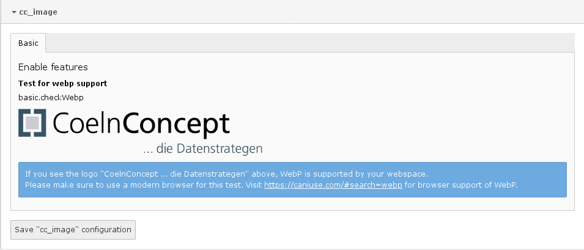

.. include:: ../Includes.txt

.. _administrator:

====================
Administrator Manual
====================

Install the extension and make sure that your webspace supports WebP. Go to *Settings -> Configure extensions* and check the WebP logo of CoelnConcept.

.. _administrator-breaking-html:

Breaking html
=============

.. important::

   This extension wraps IMG-tags in an additional PICTURE-tag to provide different sources and image fallbacks for old browsers. That may break your layout and css or javascript, especially if you use the child-selector on images e.g. :code:`p > img` (change to :code:`p > img, p > picture > img`).

.. _administrator-usage:

Usage
=====

.. _administrator-usage-fluid:

TYPO3 fluid content elements
""""""""""""""""""""""""""""

Add the static template "CC Image Fluid" for WebP support in regular content elements like "Text & Images" somewhere after "Fluid Content Elements".

.. _administrator-usage-news:

Extension news
""""""""""""""

Add the static template "CC Image News" for WebP support in the extension *news*.

.. _administrator-usage-partial:

Partial Picture
"""""""""""""""

First add the path to the partialRootPaths of your extension or to your FLUIDTEMPLATE, e.g.:

.. highlight:: typoscript

   page.10.partialRootPaths.5 < plugin.tx_ccimage.view.partialRootPaths.0
   
   plugin.tx_ccexample.view.partialRootPaths.5 < plugin.tx_ccimage.view.partialRootPaths.0

With an image object:

.. code-block:: html

   <f:render partial="Picture" arguments="{image:image, title:image.title, alt:image.alternative, maxWidth:settings.media.maxWidth, maxHeight:settings.media.maxHeight}" />

With an image src-path:

.. code-block:: html

   <f:render partial="Picture" arguments="{src:'EXT:cc_example/Resources/Public/Images/image.png', title:'title', alt:'alternative image text', maxWidth:settings.media.maxWidth, maxHeight:settings.media.maxHeight}" />

.. _administrator-usage-breakpoints:

Breakpoints
"""""""""""

Maximum image width in px:

========  ====  ====
viewport  image size
--------  ----------
dpi        1x    2x
========  ====  ====
    1250  1920  org
    1000  1280  1920
     750   960  1280
     480   768   960
     250   480   768
========  ====  ====

.. _administrator-usage-inlinesvg:

Inline-SVG
""""""""""

With an image object:

.. code-block:: html

   <html
     xmlns:f="http://typo3.org/ns/TYPO3/CMS/Fluid/ViewHelpers"
     xmlns:cci="http://typo3.org/ns/CoelnConcept/CcImage/ViewHelpers"
     data-namespace-typo3-fluid="true">
   
   <cci:image.inlineSvg image="{svgImage}" />
   
   </html>

With an image src-path:

.. code-block:: html

   <html
     xmlns:f="http://typo3.org/ns/TYPO3/CMS/Fluid/ViewHelpers"
     xmlns:cci="http://typo3.org/ns/CoelnConcept/CcImage/ViewHelpers"
     data-namespace-typo3-fluid="true">
   
   <cci:image.inlineSvg src="EXT:cc_example/Resources/Public/Images/image.svg" />
   
   </html>

